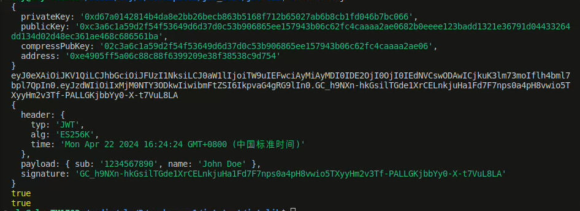

# jwt-lib

> A cryptocurrency-compliant js library
> 一个实现符合加密货币的js库
>
> Based on jsontokens library (https://github.com/stacks-network/jsontokens-js).
> 基于jsontokens库进行扩展。

## INSTALL

```shell
npm install jwt-lib-test
```

## Code demonstration

```bash
import WalletJwt from "jwt-lib-test"

const wallet = WalletJwt.generate();
console.log(wallet);
const data = {
    header:{
      time: new Date().toString(),
    },
    payload:{
      sub: '1234567890',
      name: 'John Doe',
    }
  };

const sign = WalletJwt.sign(data, wallet.privateKey);
console.log(sign);
console.log(WalletJwt.decode(sign));

// Verification by using a compressed public key
console.log(WalletJwt.verify(sign, wallet.compressPubKey));
// Verification by using a public key (uncompressed)
console.log(WalletJwt.verify(sign, wallet.publicKey, false));
```
You'll see this image and you'll see what happens.

